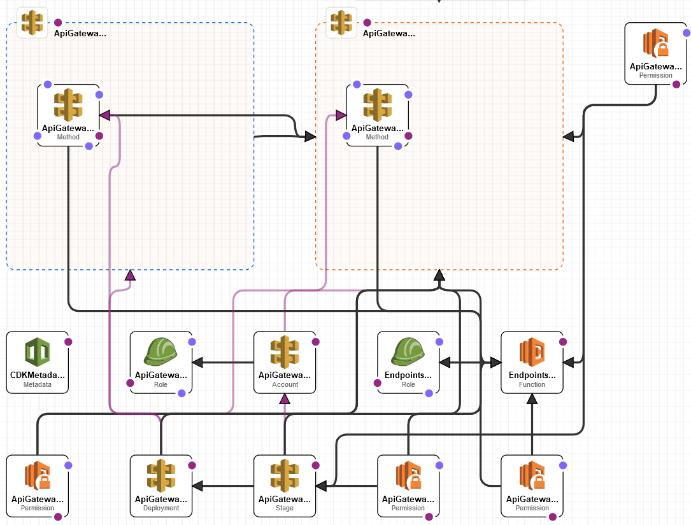
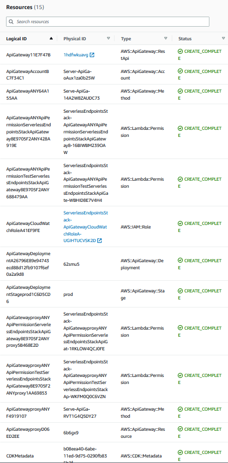

# Welcome to Serverless Endpoints Microservice
The purpose of this microservice is to create backend endpoints without ever having to maintain a server (EC2). By connecting API Gateway to Lambda, we create an on-demand, scalable, and cheap (pay-as-you-go) backend.


# Architecture
<p align="center"></p>
The architecture diagram looks more intense in the picture than in real life. What it actually entails is an API Gateway triggering a Lambda. The Lambda is a Docker image built with Python 3.9 and FastAPI (+ Mangum). The microservice is deployed with CDK, which translates to a Cloudformation template.

You may read the Lambda's Cloudwatch logs for observability: runtime duration, failures, and count of endpoint hits. If you are fancy, you can add metrics & alarms to the Lambda + API Gateway. For the business/operations/SRE team, you can New Relic to the Lambda such that there will be "single pane of glass" for 24/7 monitoring.


## Miscellaneous details:
* In this branch `BundlingOptions`, I installed `aws-lambda-powertools` as part of `requirements.txt`. In the `NoBundlingOptions` branch, I decided to attached `aws-lambda-powertools` as a Lambda Layer instead because the core code would stay below 2 MB, which allows you to still be editable mode in the Lambda console.
* Another benefit is that the `BundlingOptions` specifies the Docker image for Python 3.9 and then installs the Lambda's `requirements.txt` and thus ensures Python compatibility. The `NoBundlingOptions` branch installs `requirements.txt` using the Python version on your machine that you use to `cdk deploy`, which might not be exactly Python 3.9 and thus might install dependencies that are not compatible with the Lambda's runtime Python version.
* `cdk.json` is basically the config file. I specified to deploy this microservice to us-west-1 (California). You can change this to your region of choice.
* The following is the AWS resources deployed by CDK and thus Cloudformation:
<p align="center"></p>


# Deploying the Microservice Yourself
```
$ python -m venv .venv
$ source .venv/bin/activate
$ python -m pip install -r requirements.txt
$ cdk deploy #  Docker daemon must be running, also assumes AWS CLI is configured + npm installed with `aws-cdk`; detailed instructions at https://cdkworkshop.com/15-prerequisites.html
```